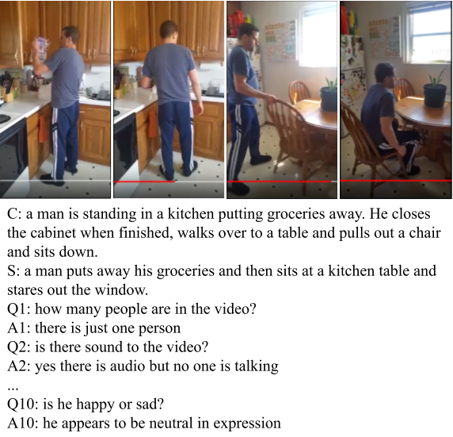
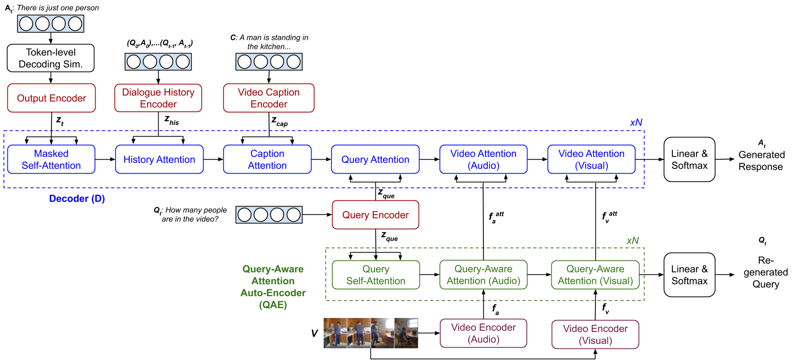
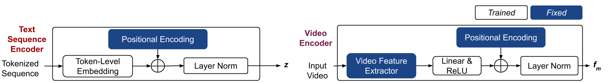
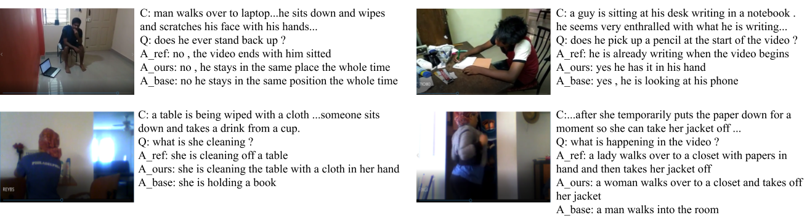

## Multimodal Transformer Networks for End-to-End Video-Grounded Dialogue Systems
 [](https://opensource.org/licenses/MIT) 

This is the PyTorch implementation of the paper:
**Multimodal Transformer Networks for End-to-End Video-Grounded Dialogue Systems**. [**Hung Le**](https://github.com/henryhungle), [Doyen Sahoo](http://www.doyensahoo.com/), [Nancy F. Chen](https://sites.google.com/site/nancyfchen/home), [Steven C.H. Hoi](https://sites.google.com/view/stevenhoi/). ***ACL 2019***. 
[link to pdf to be updated here]


This code has been written using PyTorch 1.0.1. If you use any source codes or datasets included in this repo in your work, please cite the following paper. The bibtex are listed below:
<pre>
@InProceedings{le2019mtn,
  	author = "Le, Hung and Hoi, Steven C H and Sahoo, Doyen and Chen, Nancy F",
  	title = "Multimodal Transformer Networks for End-to-End Video-Grounded Dialogue Systems",
  	booktitle = "Proceedings of the 57th Annual Meeting of the Association for Computational Linguistics (Volume 1: Long Papers)",
  	year = "2019",
  	publisher = "Association for Computational Linguistics"
}
</pre>


## Abstract
Developing Video-Grounded Dialogue Systems (VGDS), where a dialogue is conducted based on visual and audio aspects of a given video, is significantly more challenging than traditional image or text-grounded dialogue systems because (1) feature space of videos span across multiple picture frames, making it difficult to obtain semantic information; and (2) a dialogue agent must perceive and process information from different modalities (audio, video, caption, etc.) to obtain a comprehensive understanding.  Most existing work is based on RNNs and sequence-to-sequence architectures, which are not very effective for capturing complex long-term dependencies (like in videos).  To overcome this, we propose Multimodal Transformer Networks (MTN) to encode videos and incorporate information from different modalities. We also propose query-aware attention through an auto-encoder to extract query-aware features from non-text modalities. We develop a training procedure to simulate token-level decoding to improve the quality of generated responses during inference. We get state of the art performance on Dialogue System Technology Challenge 7 (DSTC7). Our model also generalizes to another multimodal visual-grounded dialogue task, and obtains promising performance.

<p align="center">

 A sample dialogue from the DSTC7 Video Scene-aware Dialogue training set with 4 example video scenes.
</p>

## Model Architecture

<p align="center">

 Our MTN architecture includes 3 major components: (i) encoder layers encode text sequences and video features; (ii) decoder layers (D) project target sequence and attend on multiple inputs; and (iii) Query-Aware Auto-Encoder layers (QAE) attend on non-text modalities from query features. For simplicity, Feed Forward, Residual Connection and Layer Normalization layers are not presented. 

2 types of encoders are used: text-sequence encoders (left) and video encoders (right). Text-sequence encoders are used on text input, i.e. dialogue history, video caption, query, and output sequence. Video encoders are used on visual and audio features of input video.
</p>

## Dataset

Download dataset of the DSTC7, Video-Scene Aware Dialogues Track, including the training, validation, and test dialogues and the features of all videos extracted using VGGish and I3D models. 

[link to dataset to be updated here]

All the data should be saved into folder `data` in the repo root folder.

## Scripts 

We created `run.sh` to prepare evaluation code, train models, generate_responses, and evaluating the generated responses with automatic metrics. You can run:

```console
❱❱❱ run.sh [execution_stage] [video_features] [video_feature_names] [numb_epochs] [warmup_steps] [dropout_rate] 
```
The parameters are: 

| Parameter           | Description                                                  | Values                                                       |
| :------------------ | :----------------------------------------------------------- | ------------------------------------------------------------ |
| execution_state     | Stage of execution e.g. preparing, training, generating, evaluating | <=1: preparing evaluation code by downloading the COCO caption evaluation tool <br /><=2: training the models<br /><=3: generating responses using beam search (default)<br /><=4: evaluating the generated responses |
| video_features      | Video features extracted from pretrained models              | vggish: audio features extracted using VGGish<br />i3d_flow: visual features extracted from I3D model <br />i3d_rgb: visual features extracted from I3D model <br />Features can also be combined, separated by single space e.g. "vggish i3d_flow" |
| video_feature_names | Names of video features for saving output                    | any value corresponding to the video_features input e.g. vggish+i3d_flow |
| num_epochs          | Number of training epochs                                    | e.g. 20                                                      |
| warmup_steps        | Number of warmup steps                                       | e.g. 9660                                                    |
| dropout_rate        | Dropout rate during training                                 | e.g. 0.2                                                     |

While training, the model with the best validation is saved. The model is evaluated by using loss per token. The model output, parameters, vocabulary, and training and validation logs will be save into folder `exps`.  

Other parameters, including data-related options, model parameters,  training and generating settings, are defined in the `run.sh` file.

## Sample Dialogues
<p align="center">

 Example test dialogue responses extracted from the ground-truth and generated by MTN and the baseline. For simplicity, the dialogue history is not presented and only parts of the video caption C are shown. Our model provides answers that are more accurate than the baseline, capturing single human action or a series of actions in the videos.
</p>

